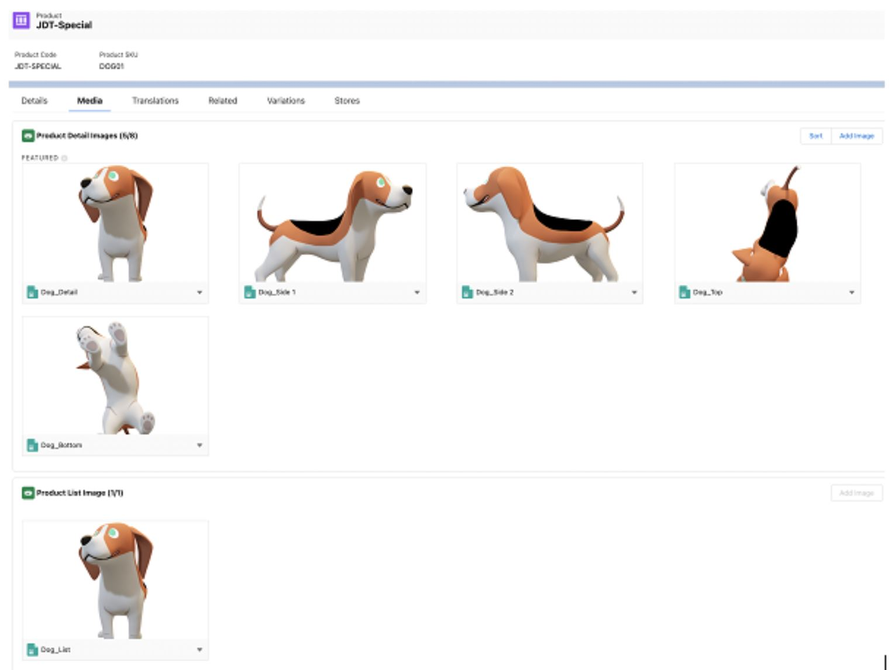

## cms-tools-nonenhanced

This project contains Apex and JAVA code relevant to Salesforce Commerce CMS functionality. Special thanks to Kevin Kintzley for contributing this solution as part of the Code-It-Forward effort!

# CMS Tools QuickStart

## Java CreateSalesforceCmsInput

The java program has the following command arguments:
```
--createCmsImageTemplate [directory path]
```
 - Creates an Excel template where can populate the product SKUs associated with an  image. **Note**: The input contains the Sort Order column.  Zero represents a list image. One through eight represent product detail images.
 - Also, it creates _media directory and copies all the files there.

```
--createCmsImageJsonInput
```
 - Once the template is populated, this command creates the Salesforce CMS input zip file.

```
-allfiles
```
 - Create the Salesforce CMS input zip for all files in a directory, regardless if a SKU exists
 ## Apex CMSToolsSuite

### CMSToolsSuite.processNewProductImages([Community Name]);
 - After you import the zip file into CMS, this script automatically associated those new images to Salesforce products. Note: The products must not have any existing product images.

## Prerequisites

 - Install [Java extension](https://code.visualstudio.com/docs/java/extensions) for VS Code

### Install Java Code

- Create a new visual Studio Code Java project
- Command Pallet: Java: Create Java Project. Select No Build Tools
- Now choose a project folder. Then type a Java project name, for example, CMS Tools

#### Add Jars Files to the lib Directory
- Go to [MVN Repository](https://mvnrepository.com/). Click on the latest release version.
- Click on the jar file to download.
- Copy the file to project’s lib directory

| Library | Jar File Name |
| ----------- | ----------- |
| [Apache Commons CLI](https://mvnrepository.com/artifact/commons-cli/commons-cli) | [commons-cli-1.5.0.jar](https://repo1.maven.org/maven2/commons-cli/commons-cli/1.5.0/commons-cli-1.5.0.jar) |
| [Apache Commons IO] | [https://repo1.maven.org/maven2/commons-io/commons-io/2.13.0/commons-io-2.13.0.jar][commons-io-2.13.0.jar](https://mvnrepository.com/artifact/commons-io/commons-io) |
| [Apache Commons Collections](https://mvnrepository.com/artifact/org.apache.commons/commons-collections4) | [commons-collections4-4.4.jar](https://mvnrepository.com/artifact/org.apache.commons/commons-collections4/4.4) |
| [Apache Log4j Core](https://mvnrepository.com/artifact/org.apache.logging.log4j/log4j-core) | [log4j-core-2.20.0.jar](https://repo1.maven.org/maven2/org/apache/logging/log4j/log4j-core/2.20.0/log4j-core-2.20.0.jar) |
| [Apache Log4j API][https://mvnrepository.com/artifact/org.apache.logging.log4j/log4j-api] | [log4j-api-2.20.0.jar](https://repo1.maven.org/maven2/org/apache/logging/log4j/log4j-api/2.20.0/log4j-api-2.20.0.jar) |
| [Apache Commons Compress](https://mvnrepository.com/artifact/org.apache.commons/commons-compress) | [commons-compress-1.23.0.jar](https://repo1.maven.org/maven2/org/apache/commons/commons-compress/1.23.0/commons-compress-1.23.0.jar) |
| [Apache POI](https://mvnrepository.com/artifact/org.apache.poi/poi) | [poi-5.2.3.jar](https://repo1.maven.org/maven2/org/apache/poi/poi/5.2.3/poi-5.2.3.jar) |
| [Apache POI OOXML Schemas full](https://mvnrepository.com/artifact/org.apache.poi/poi-ooxml-full) | [poi-ooxml-full-5.2.3.jar](https://repo1.maven.org/maven2/org/apache/poi/poi-ooxml-full/5.2.3/poi-ooxml-full-5.2.3.jar) |
| [Zip4j](https://mvnrepository.com/artifact/net.lingala.zip4j/zip4j) | [zip4j-2.11.5.jar](https://repo1.maven.org/maven2/net/lingala/zip4j/zip4j/2.11.5/zip4j-2.11.5.jar) |
| [Jackson Core](https://mvnrepository.com/artifact/com.fasterxml.jackson.core/jackson-core/) | [jackson-core-2.15.2.jar)](https://repo1.maven.org/maven2/com/fasterxml/jackson/core/jackson-core/2.15.2/jackson-core-2.15.2.jar) |
| [XmlBeans](https://mvnrepository.com/artifact/org.apache.xmlbeans/xmlbeans) | [xmlbeans-5.1.1.jar](https://mvnrepository.com/artifact/org.apache.xmlbeans/xmlbeans/5.1.1) |

#### Command Line Arguments Input Configuration
- Copy the CreateSalesforceCmsInput.java code to the src folder.
- Open the code.
- Navigate to Run > Add Configuration to create a launch.json file. The file is located in the .vscode.
- Open the file JSON. Locate the section for CreateSalesforceCmsInput.
- Add the line at the beginning before the line "type": "java"
"args": "${command:SpecifyProgramArgs}",
- Save the file.

#### Run createCmsImageTemplate
- Right click on the Java file and select Run Java.
- Enter the following argument in command palette
```
--createCmsImageTemplate /[directory path]/[image folder]
```
- For example,
```
--createCmsImageTemplate /Users/[User Name]/Downloads/CMS/Test
```
 - Now populate the spreadsheet with product SKUs and the Sort Order. Note: Security has been added to the spreadsheet so that you cannot edit the Filename column.
- Next run the second Java command line argument to create the Salesforce CMS input zip file. For Example,
```
--createCmsImageJsonInput /Users/[User Name]/Downloads/CMS/Test
```

#### Import Zip File into Salesforce CMS
- Login into the Salesforce org.
- In the App Launcher, type Digital Experiences, to start the application.
- In the menu, choose Digital Experiences Home.
- Navigate the CMS workspace related to the B2B store.
- Click the triangle(🔻) and select Import Content.
- In the file dialog window, navigate to the directory where you just created the CMS zip file. If for some reason the file dialog does not appear. please restart your browser.

#### Run Script CMSToolsSuite.processNewProductImages([Community Name]);
- Launch Visual Studio Code that is connected to the Saleforce environment.
- In the Scripts folder, open the hello.apex script or create a new script file.
- Paste the command. Note: Update the Community Name value.
CMSToolsSuite.processNewProductImages([Community Name]);
- Save the change.
- Highlight the command with your mouse.
- Then press the keys Shift +Command + P to open the Command Palette. Select SFDX: Execute Anonymous Apex with Currently Selected Text.
- In the Output window, you will see the script output. You should see a line similar to the the following:

```
#   ProductMedia Id SKU Name    Product Id
1   2pm170000008OprAAE  DOG01   JDT-Special 01t2M000005pzZxQAI
2   2pm170000008OpsAAE  DOG01   JDT-Special 01t2M000005pzZxQAI
3   2pm170000008OptAAE  DOG01   JDT-Special 01t2M000005pzZxQAI
4   2pm170000008OpuAAE  DOG01   JDT-Special 01t2M000005pzZxQAI
5   2pm170000008OpvAAE  DOG01   JDT-Special 01t2M000005pzZxQAI
6   2pm170000008OpwAAE  DOG01   JDT-Special 01t2M000005pzZxQAI
```

- Open the product record in Salesforce. Click on the Media tab to view the results:




